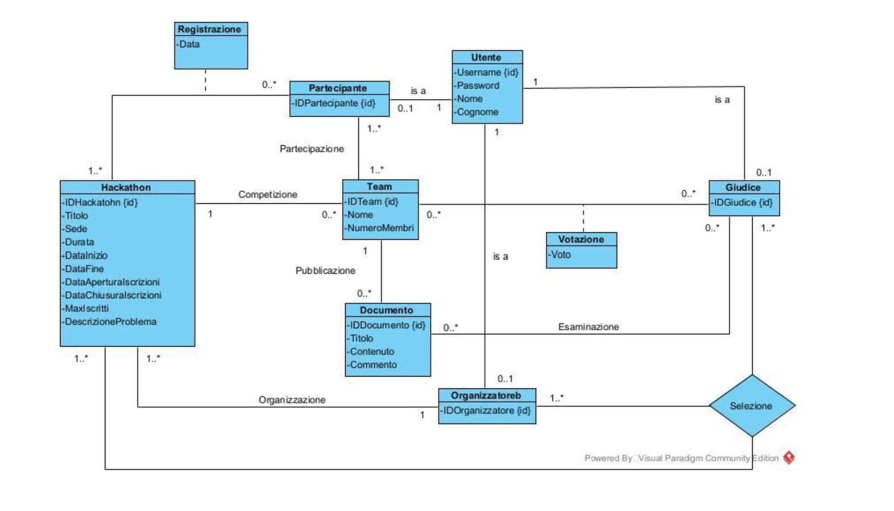

# 🏆 Relational Database Architecture: Hackathon Management System


## 📌 Overview
This repository contains the complete physical and logical design of a **relational database architecture** built in PostgreSQL, designed to manage the end-to-end lifecycle of competitive programming events (Hackathons). 

Instead of relying on an external application layer, this project implements complex business logic, data validation, and constraint enforcement directly at the database level using **advanced SQL components** such as custom Triggers, Stored Procedures, and PL/pgSQL Functions.

📚 **Full Technical Documentation**: [Click here to read the detailed PDF (Italian) explaining the normalization process, E-R diagrams, and data redundancy analysis.](./PROGETTO_HACKLATON_MARIO_PALLADINO_N86005143.pdf)

---

## ⚙️ Core Architecture & Features

The system models a complex environment involving Organizers, Judges, Participants, and Teams, handling registrations, submissions, and final grading. 

### 1. Robust Constraint Enforcement (Triggers)
To ensure database integrity without an external backend, several constraints are strictly enforced via PL/pgSQL Triggers:
* **`double_role_t`**: Ensures a user cannot participate as a contestant if they are already registered as a Judge or Organizer for the same event.
* **`check_complete_examination_t`**: Prevents Judges from submitting a final score for a Team unless they have reviewed every single progress document submitted by that Team.
* **`unique_team_name_t`**: Guarantees team name uniqueness restricted to the scope of a single Hackathon context.

### 2. Business Logic Automation (Stored Procedures)
Critical operations are automated using Stored Procedures to handle transactions safely:
* **`join_team`**: Manages the complex logic of a user switching teams, ensuring time constraints are met, maximum team capacities are respected, and updating member counts dynamically.
* **`end_hackathon`**: Automatically runs at the event's conclusion, verifying all votes are cast (inserting default scores if a Judge missed a vote) and generating the final leaderboard.
* **`subscribe`**: Handles user registration to an event, automatically creating a default solo-team while checking capacity limits.

### 3. Entity Hierarchy & Historical Data
* The database implements a **Generalization Hierarchy** (`User` as the parent entity; `Participant`, `Judge`, `Organizer` as children) mapping the conceptual model effectively into the relational schema.
* The design natively supports historical tracking, allowing queries like "How many events did this Organizer run last year?" or "What was the average score this Judge gave across multiple Hackathons?" via N-ary relationships (`Selection`).

---

## 🗄️ Conceptual Schema (E-R)
Diagramma ristrutturato espresso tramite i formalismi dell'UML
 


---

## 🚀 How to Run

1. Make sure you have **PostgreSQL** installed on your machine.
2. Clone this repository:
   ```bash
   git clone [https://github.com/fiammass/hackathon-database-system.git](https://github.com/fiammass/hackathon-database-system.git)
